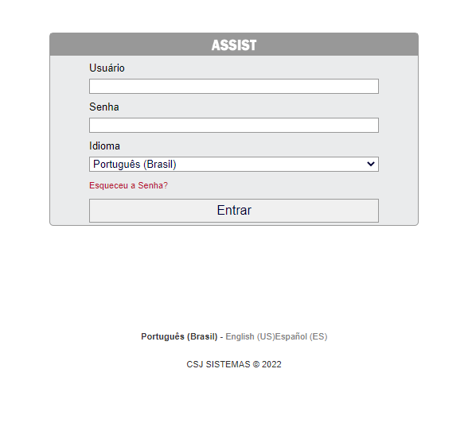
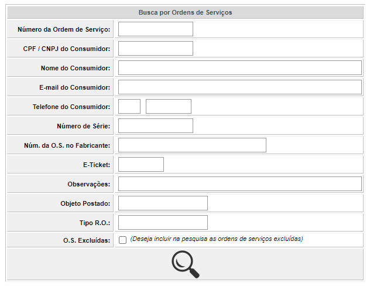
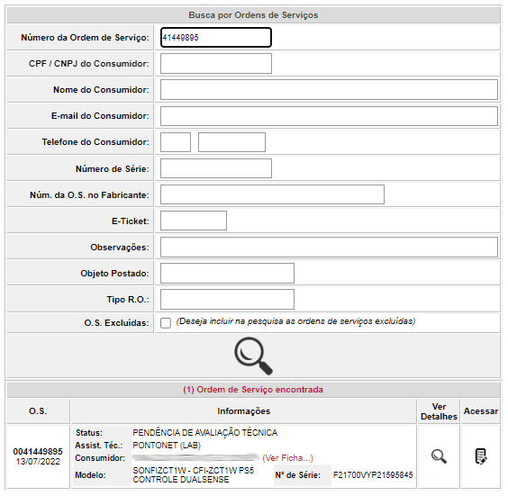
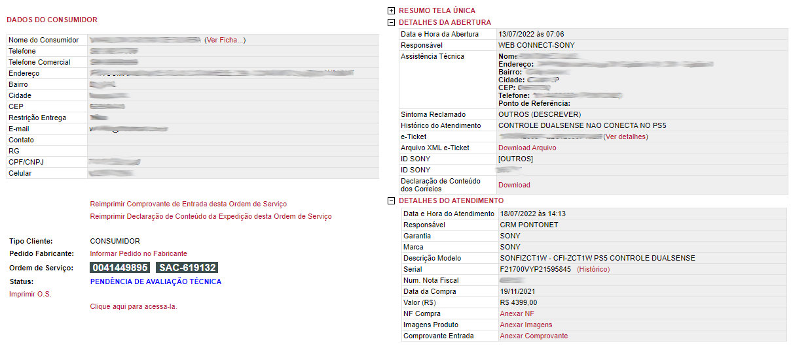
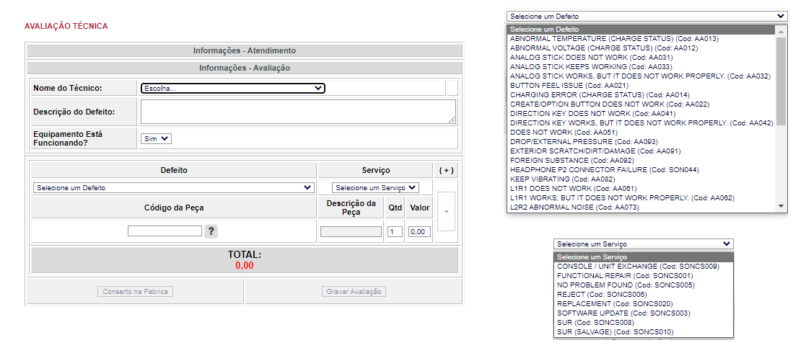
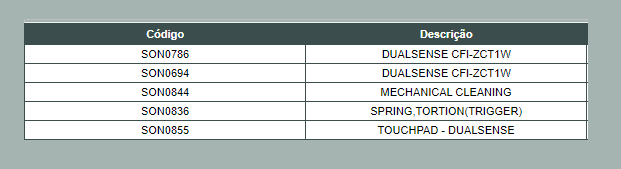

# Script feito com Selenium e PySimpleGUI

  Esse script é o meu primeiro projeto em python, o fiz para facilitar o processo de avaliação de produtos no sistema em meu antigo trabalho.
  
  Como todo o processo não pode ser testado, devido ser necessário o login com o sistema da empresa, irei exemplificar abaixo como o script funciona.

## Descrição da tarefa que será automatizada

  Nós recebiamos cerca de 100 produtos de clientes por dia, para que fosse realizado o reparo ou troca por um novo, para facilitar o processo de avalicação no sistema e requisação de peças ou produto novo, um relatório era baixado, contendo todas as ordens de serviço para avaliação, entravamos em cada uma delas e analisava o defeito reclamado pelo cliente, assim faziamos a avaliação conforme defeito reclamado. 
  
  Como era uma tarefa muito repetitiva, facilmente poderia ser automatizado, como estava aprendendo Python, foi a oportunidade perfeita!!
  
  
 ## O Sistema
 
 ### O sistema é acessado online pelo navegador.
  
  Abaixo temos a tela de login:
  
  
  
  
 ### A seguir, a tela de busca de ordem de serviço.
 
 Pode-se utilizar qualquer informação do cliente, porém para o nosso caso, utilizaremos apenas o número da ordem de serviço, o primeiro item:
  
  
  
  
 ### Resultado da pesquisa de uma ordem de serviço.
 
 Aqui está o resultado quando realizamos a busca por uma ordem de serviço.
 Podemos verificar algumas informações básicas sobre o cliente e o produto, atentem-se pelo STATUS, que está em pendência de avaliação:
 
 
 
 
 ### Pagina completa de informações
 
 Quando clicamos em ver detalhes da imagem anterior, temos a pagina completa, onde contém todas as informações do cliente, todas as informações do produto e o mais importante para nós, o DEFEITO RECLAMADO (contido no histórico de atendimento, que neste caso é "CONTROLE DUALSENSE NÃO CONECTA NO PS5"):
 
 
 
 
 ### Pagina de avaliação
 
 Aqui é onde colocamos a analise do defeito, algumas informações sobre o defeito contidos na seleção de dropdown e selecionamos a peça que será requisitada do estoque.
 
 
 
 A seguir é a lista de produtos que podem ser requisitados para este modelo de produto (está lista pode mudar conforme o modelo de produto do cliente)
 
 
 
 
 ### Observações
 
 Podemos ver que a avaliação é bem simples de ser completada, apenas vendo o defeito reclamado pelo cliente decidimos o reparo que será efetuado.
 Lembrando que são mais de 100 produtos por dia, essas avaliações poderiam durar até 3 horas para se completar, e ainda poderiam haver falhas humanas na avaliação.
 
Os defeitos mais comuns que são avaliados automaticamente:

- Defeitos em analógicos - O produto é trocado nestes casos, pois o reparo é muito demorado.
- Defeito de não liga - O produto é trocado nestes casos.
- Defeitos nos gatilho - É efetuado a troca da mola e limpeza interna.
- Defeito nos botões - Limpeza interna.
- Defeitos de botões emperrando - Limpeza interna, apenas é trocado o defeito do dropdown na imagem 5 

# Script em funcionamento

  Segue um video simples que fiz do script em funcionamento, em formato GIF, caso queira ver o video com mais calma, será disponibilizado os links do youtube.
  
  Quem fára o uso desse script, serão pessoas comuns da produção, então tentei deixar o mais amigavel possivel as configurações:
  
  
  
  ### Explicação do script
  
  - Passo 1 - É fornecido ao script um documento TXT com todas as ordens de serviços que estão em AVALIAÇÃO, essa informação é retirada de um relatório baixado pelo próprio sistema da empresa, na qual fornece as ordens de serviço em excel com os seus status. (Realizei outro script que faz a download automatico deste relatório e separa as ordens de serviço pela avaliação, porém ainda não foi incorporado na aplicação no PySimpleGUI)
  
  - Passo 2 - Realizar o login com as credenciais fornecidas pela empresa, a autenticação é feita por conta do proprio sistema da empresa, o script apenas verifica se o login foi bem sucedido.
  
  - Passo 3 - Deverá fornecer a informação do técnico que está fazendo a avaliação (utilizado na pagina de avaliação), de onde virá a peça (do estoque ou Salvage, que é um peça que já está no laboratorio) e o arquivo TXT contendo as ordens de serviços.
  
  - Passo 4 - A tela de avaliação, mostra o andamento do script e o progresso, contendo algumas informações que depois serão convertidas em um arquivo em excel.
  
  #  Segue abaixo a finalização desse video teste
  
  Perceba que ao inicio do script foram passadas 3 ordens de serviço ao script (conferir o inicio do primeiro video), como este arquivo possuia uma frase logo abaixo, foi considerada como uma outra ordem de serviço.
  O excel é aberto automaticamento ao apertar o botão 'Sair'.
  
  
  
  Resultado:
  
  - Duas ordens de serviço foram avaliadas com sucesso!
  - Uma ordem de serviço deu erro, que pode ser analisado depois.
  - E o script tentou acessar a ordem de serviço com uma frase, na qual ele não conseguiu nenhuma informação, e retornout N/F.
  
  # Conclusão
  
  O script demora cerca de 15 min para fazer a avaliação de 100 ordens de serviços, coisa que antes demorava algumas horas.
  Esse tempo poderia ser diminuido drasticamente, na época eu não tinha tanto conhecimento em html e http como hoje, para deixar o script mais performatico. 
  
  Eu poderia ter utilizado um SQlite ou até mesmo um arquvio JSON para armazenar algumas configurações, armazenar as ordens ja avaliadas, deixando o código um pouco mais limpo.
  
  Uma melhoria interessante, também seria deixar o script para ser rodado automaticamente todos os dias em algum horário, baixando o relatório e realizando as avaliações automaticamente.
  
  OBS: Esse projeto e Script, não foi algo pedido pela empresa e não foi algo que possuia suporte para faze-lo, fiz apenas para o aprendizado e ainda ajudar a galera do meu laboratório a ganhar um pouco de tempo de serviço.
  
  Videos no youtube (Estão acelerados):
  
  - Video 1 - https://youtu.be/8tG_nB3DnTM
  - Video 2 - https://youtu.be/IXuCGjnRwGA
